# PhD Portfolio — Urban Mobility, Spatial Analysis & Geospatial Machine Learning

Visual portfolio of my PhD research at **Monash University** (Transport Engineering, 2021–2026).  
This repo presents the frameworks, workflows, and key results from three case studies on **active travel and shared micromobility in Melbourne**, using social media data, urban heat island modelling, and interpretable machine learning.

📄 **Publications**: see [Google Scholar](https://scholar.google.com/citations?user=xtDZ5SEAAAAJ&hl=en)  
🔗 **Profile**: [LinkedIn](https://www.linkedin.com/in/jason-li-735702154/) · [Main GitHub](https://github.com/liteng16)

---

## 📌 Overview of Case Studies

| # | Topic | Data | Methods |
|---|---|---|---|
| 1 | [NLP for active-travel extraction from social media](#case-1-unveiling-active-travel-from-social-media-with-nlp) | Twitter, Greater Melbourne, 2018–2021 | BERT classification · Named Entity Matching · Location fusion |
| 2 | [Spatial heterogeneous impacts of urban heat island on active travel](#case-2-spatial-heterogeneous-impacts-of-urban-heat-island-on-active-travel) | Mesh Block UHI index + social-media-derived trips | Multiscale Geographically Weighted Regression (MGWR) |
| 3 | [Non-linear effects on shared e-scooter speed](#case-3-non-linear-effects-on-shared-e-scooter-speed) | Lime e-scooter & e-bike GPS trajectories (Melbourne CBD) | Map-matching · XGBoost / Random Forest / CatBoost · SHAP |

---

## Case 1: Unveiling Active Travel from Social Media with NLP

> **Problem.** Social media is a rich but noisy source of active-travel signals. Most tweets lack precise geo-coordinates, so spatial analysis is usually limited to the small fraction of geo-tagged posts.  
> **Contribution.** A BERT-based classification + content-based location extraction pipeline that turns ungeotagged tweets into mappable active-travel trips, expanding the usable dataset substantially.

### Framework
End-to-end pipeline: data cleansing → tweet classification → location extraction (Con-Loc + Geo-Loc) → information fusion.
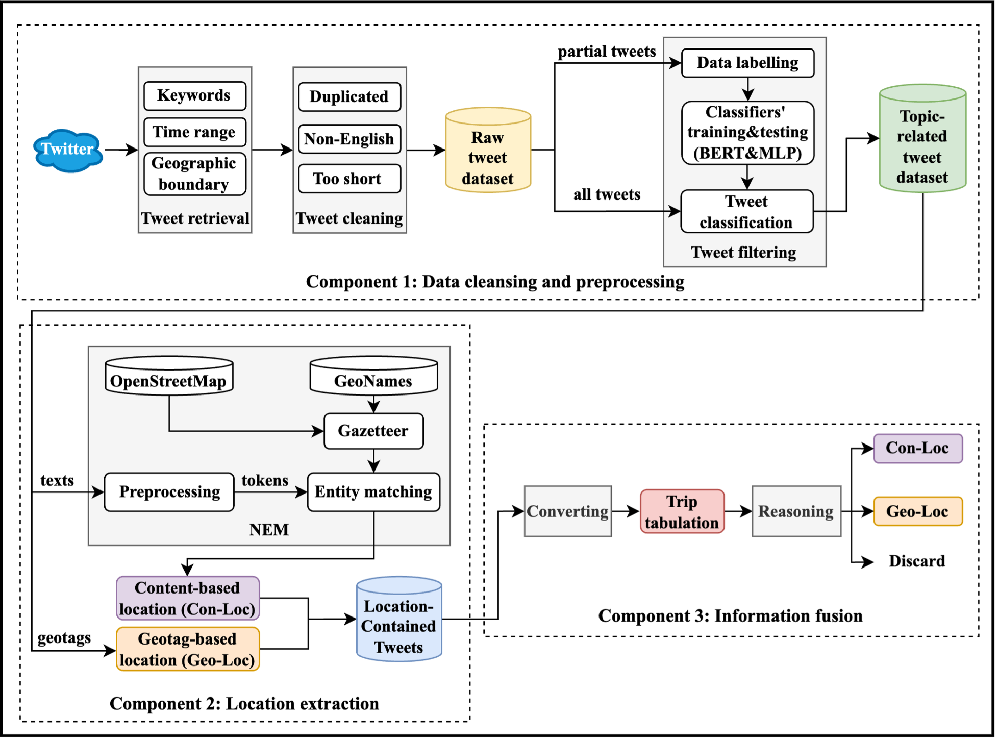

### BERT-CLA Classifier Architecture
Transformer-based encoder + linear classification head for identifying active-travel-related tweets.
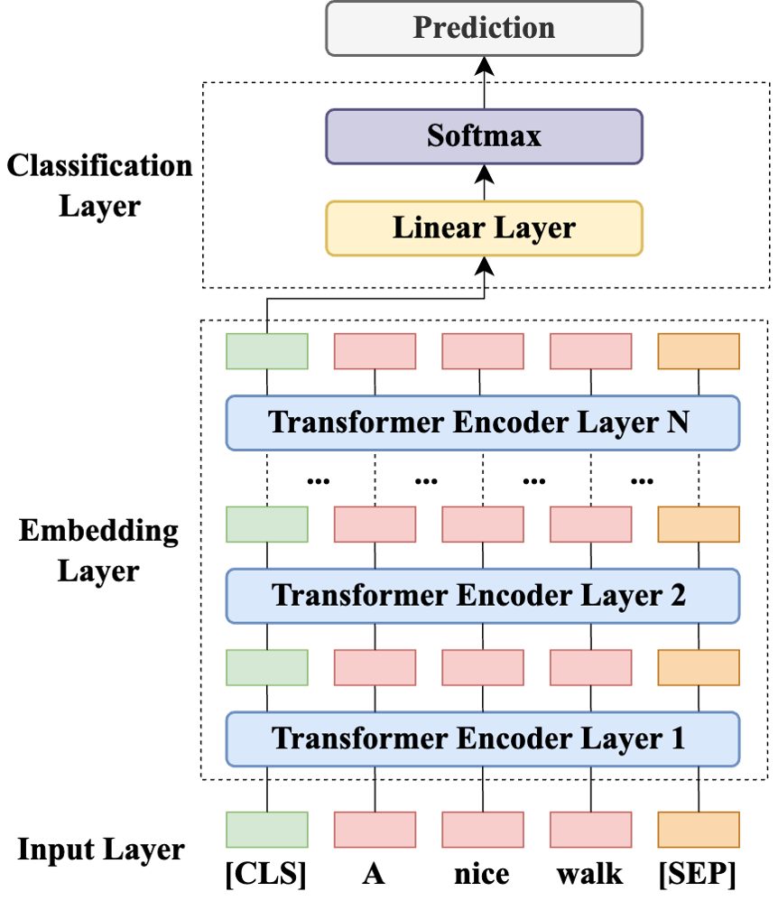

### Location Fusion Strategy
Reconciles content-based locations (extracted from tweet text via NEM) with geotag-based locations, with conflict-resolution rules.
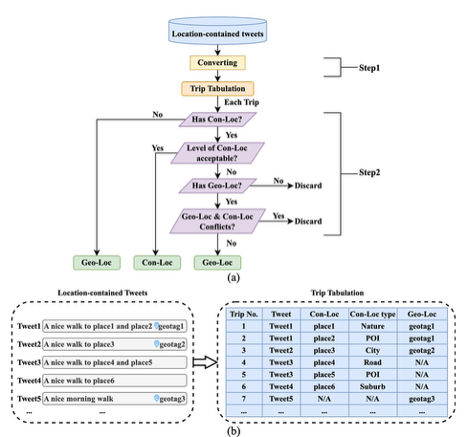

### Results

**Extracted active-travel locations across Greater Melbourne (2018–2021)** — 4,042 POI-level observations recovered from text content, where geotagging alone would have missed most of them.
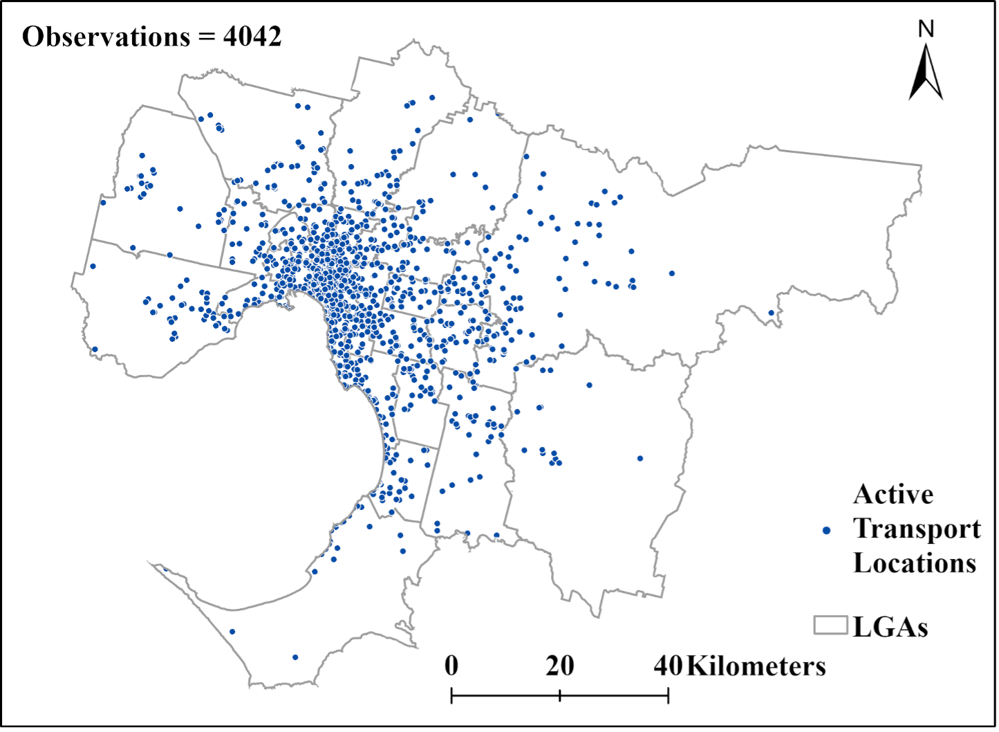

**Variation across 31 LGAs, Pre-COVID vs COVID period:**

*(a) Spatial change in location ratio by LGA*
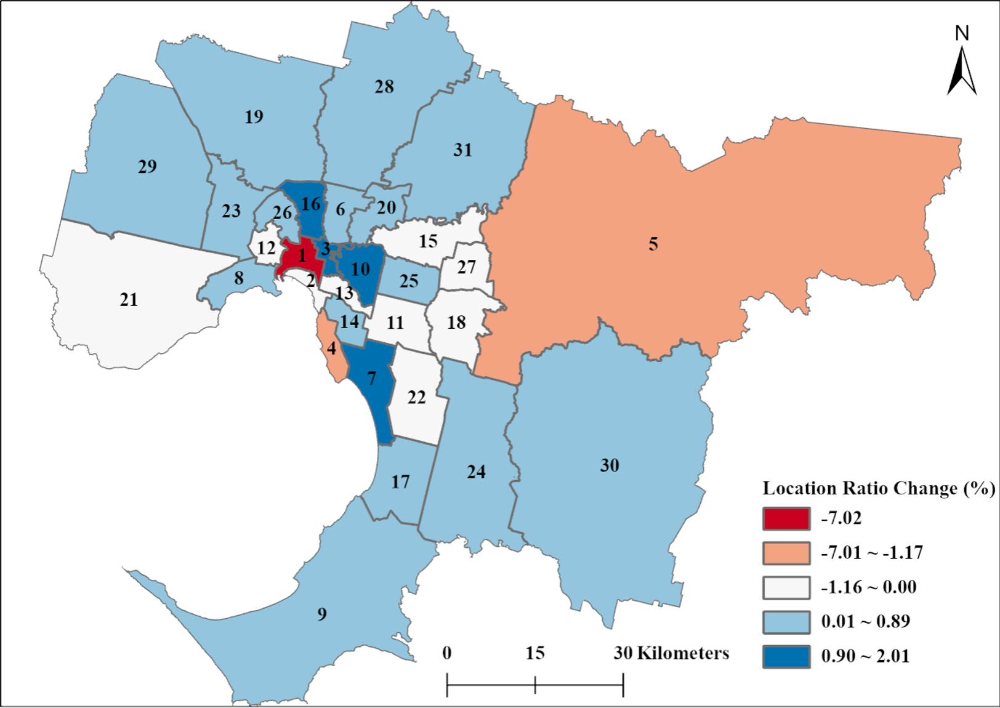

*(b) Ratio comparison across LGAs*
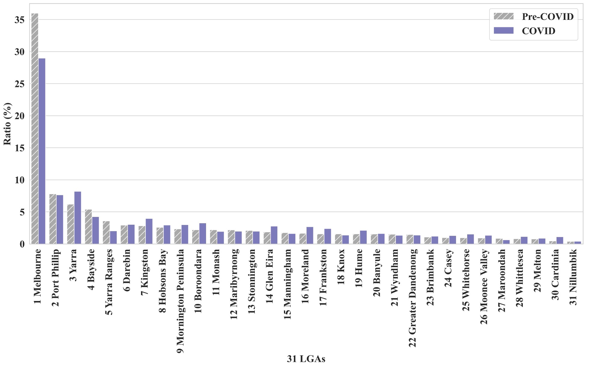

📄 **Publication (full paper included)**: *Identifying active transport from spontaneous data sources with natural language processing*, **TRB 2024** — [Google Scholar](https://scholar.google.com/citations?view_op=view_citation&hl=en&user=xtDZ5SEAAAAJ&citation_for_view=xtDZ5SEAAAAJ:d1gkVwhDpl0C) · [PDF in repo](assets/TRB_2024_Teng_NLP.pdf)  
💡 **Patent**: *A method for integrating geotagged location and text location information in social media* — [CN117236316B](https://patents.google.com/patent/CN117236316B/zh)

---

## Case 2: Spatial Heterogeneous Impacts of Urban Heat Island on Active Travel

> **Problem.** Urban heat island (UHI) effects on active travel are typically modelled as spatially uniform — but heat exposure and behavioural response vary substantially across the city.  
> **Contribution.** First spatial-heterogeneous assessment of UHI on active travel in Melbourne, using **Multiscale Geographically Weighted Regression (MGWR)** at Mesh Block resolution. MGWR allows each covariate (UHI, parkland, transit access, demographics, etc.) to operate at its own optimal spatial scale, revealing that different drivers of active travel respond to urban heat at fundamentally different geographic ranges.

### Urban Heat Island Index — Mesh Block level, Greater Melbourne
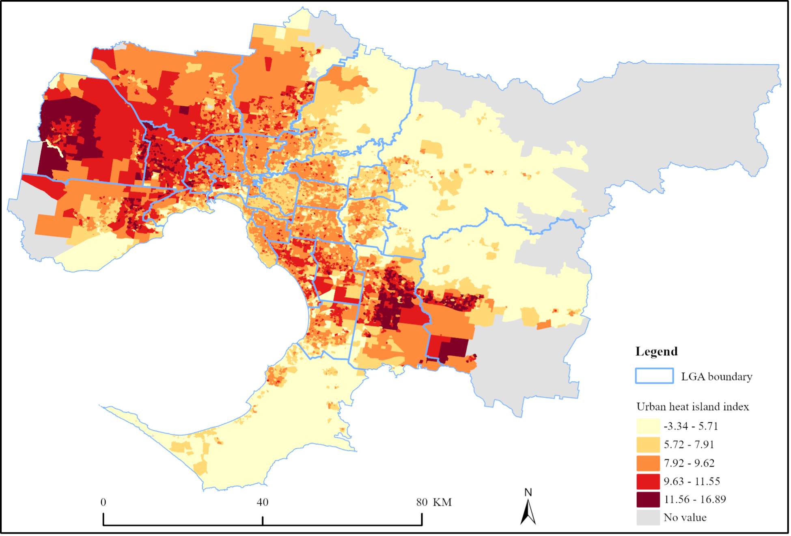

### Spatial Heterogeneity of UHI Impact (MGWR coefficients)

**UHI effects on all-day vs summer-only active-travel trips:**
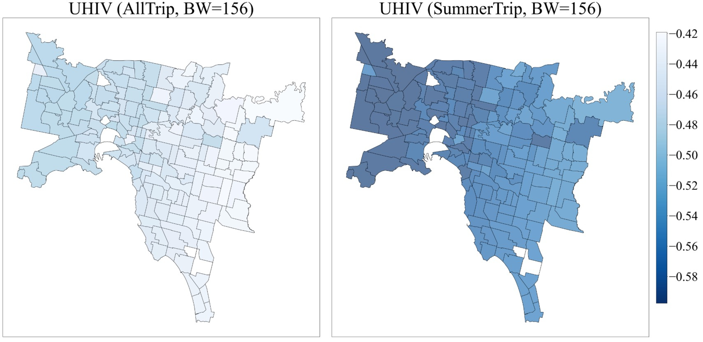

**MGWR coefficients for built-environment & socio-demographic controls** (Parkland, Tram stop density, Bus stops, Population density, Age 15–34, Household income, Unemployment, Higher education, Vehicle ownership). Each variable's panel shows its own optimal bandwidth (BW), indicating the spatial scale at which it most strongly affects active travel:
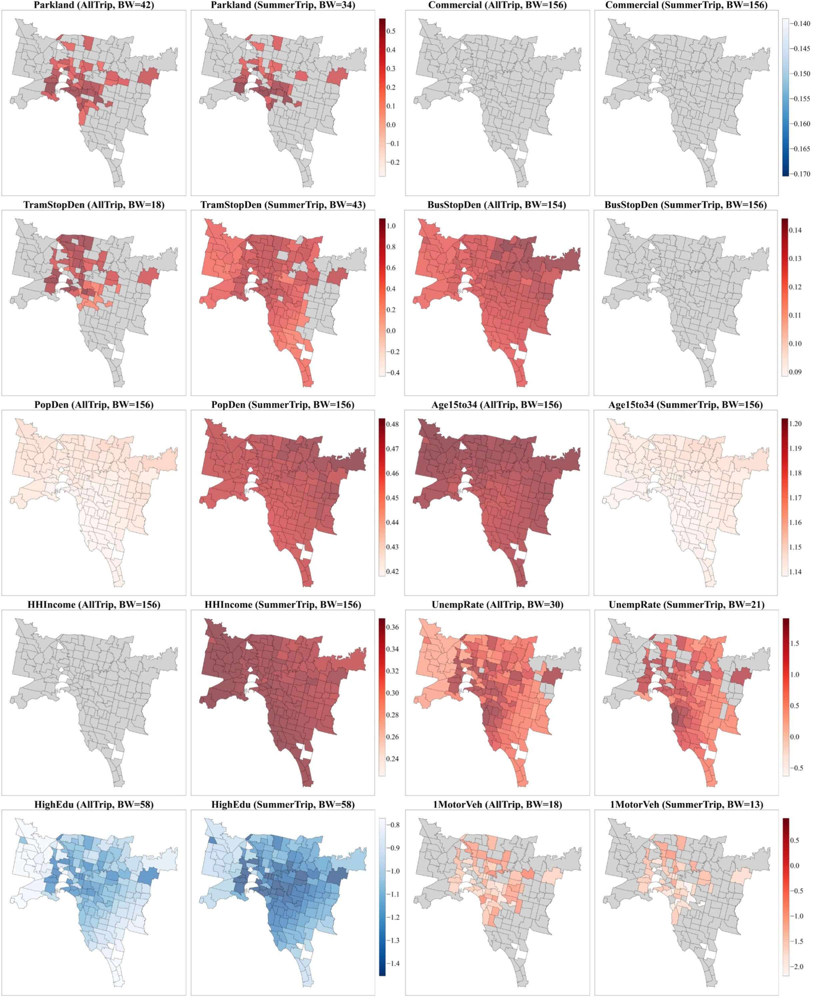

📄 **Publication (full paper included)**: *Assessing the spatial heterogeneous impacts of urban heat island effects on active travel by leveraging social media data*, ***Sustainable Cities and Society***, 2025 — [ScienceDirect](https://www.sciencedirect.com/science/article/pii/S2772586325000577) · [PDF in repo](02-uhi-active-travel/paper.pdf)

---

## Case 3: Non-linear Effects on Shared E-Scooter Speed

> **Problem.** Linear models of micromobility speed miss the threshold and non-monotonic behaviours that matter most for infrastructure design.  
> **Contribution.** Interpretable ML on shared e-scooter & e-bike GPS trajectories (Lime, Melbourne CBD). SHAP reveals non-linear thresholds in shared-lane traffic speed, POI density, residential density, intersection volume, and air temperature.

### Modelling Framework
Data preprocessing → map-matching → point-pairing → feature engineering → tree-based models → SHAP.
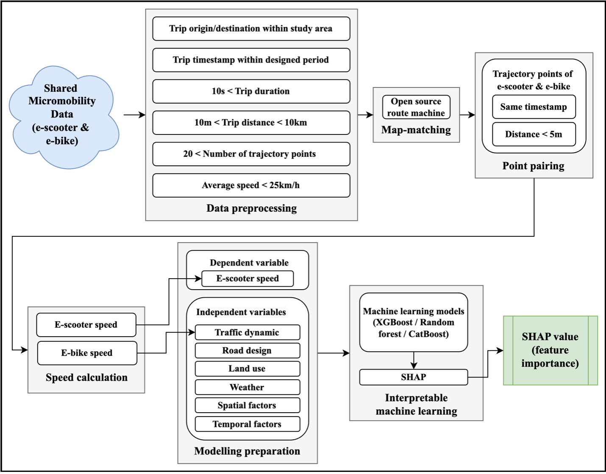

### Study Area — Melbourne CBD and surroundings
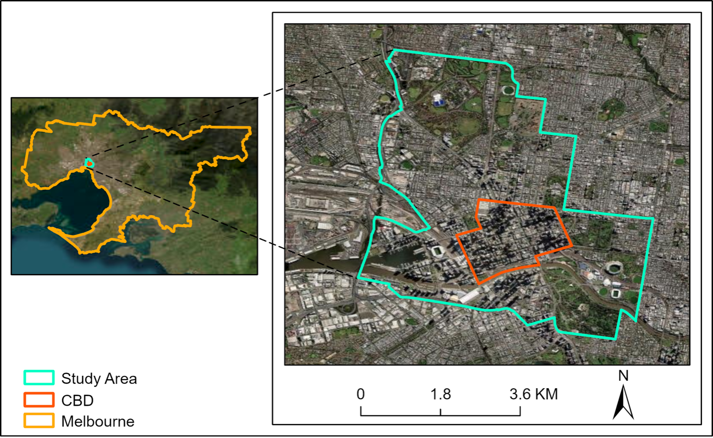

### Data Overview — Weekday vs weekend trip density
Spatial distribution of shared e-scooter and e-bike trips across the study area.
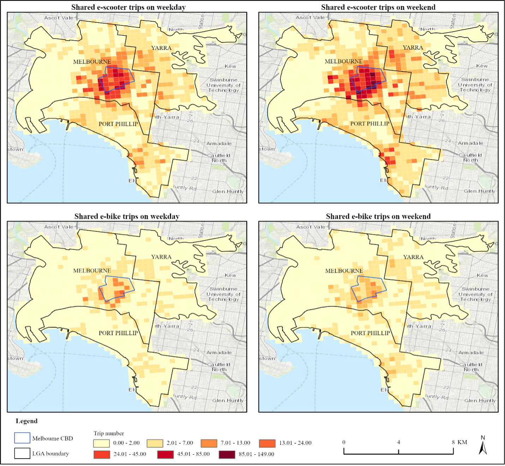

### SHAP-based Feature Importance

*(a) Per-observation SHAP values (violin plot):*
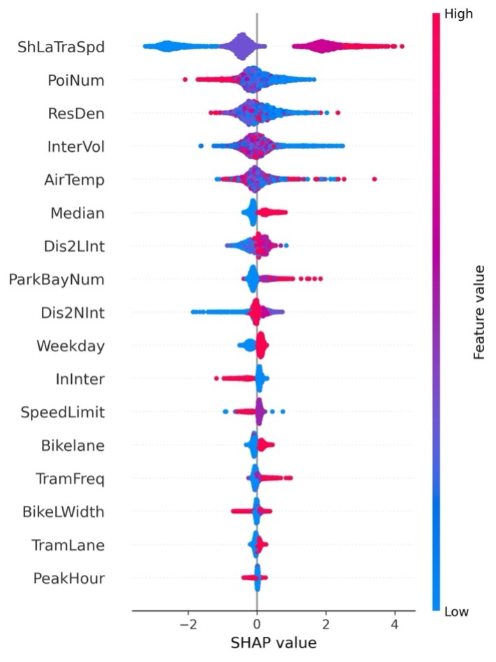

*(b) Mean absolute SHAP value (importance ranking):*
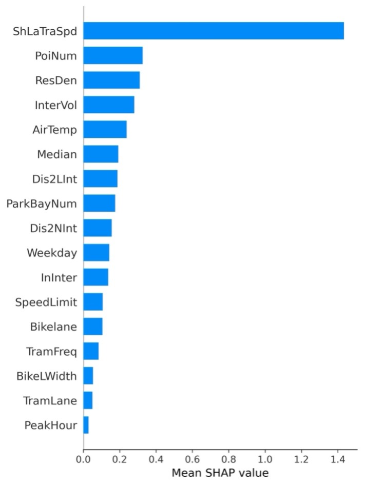

### Non-linear Partial Dependence (top continuous features)
Threshold and curvilinear effects of POI density, residential density, intersection volume, and air temperature on e-scooter speed.
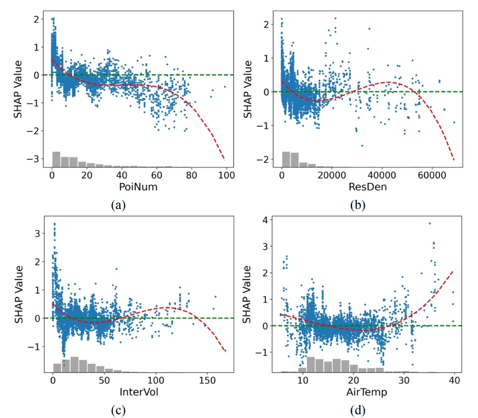

📄 **Related conference paper**: *Investigating the travel behaviour of e-scooter riders in Melbourne: A spatiotemporal analysis with PCA*, **ATRF 2024** — [view](https://australasiantransportresearchforum.org.au/investigate-the-travel-behaviour-of-e-scooter-riders-in-melbourne-a-spatiotemporal-analysis-with-pca/)

---

## 🛠️ Technical Stack

**Languages** — Python, SQL, R  
**Geospatial** — ArcGIS Pro, QGIS, PostGIS, GeoPandas, Shapely  
**Spatial statistics** — MGWR (mgwr Python library), Moran's I, spatial autocorrelation analysis  
**ML / NLP** — PyTorch, Hugging Face Transformers, XGBoost, CatBoost, scikit-learn, SHAP  
**Data engineering** — PySpark, ETL pipelines on large GPS trajectory datasets, map-matching with OSRM  
**Visualisation** — ArcGIS cartography, matplotlib, Folium

---

## 📬 Contact

For role discussions, collaborations, or methodology questions:  
[LinkedIn](https://www.linkedin.com/in/jason-li-735702154/) · [Main GitHub](https://github.com/liteng16) · [Email](mailto:huangshanhf@gmail.com)
